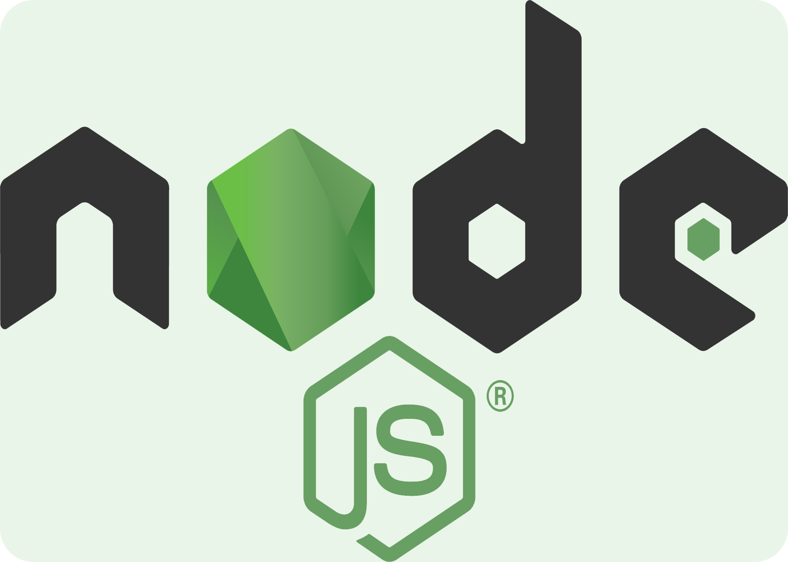
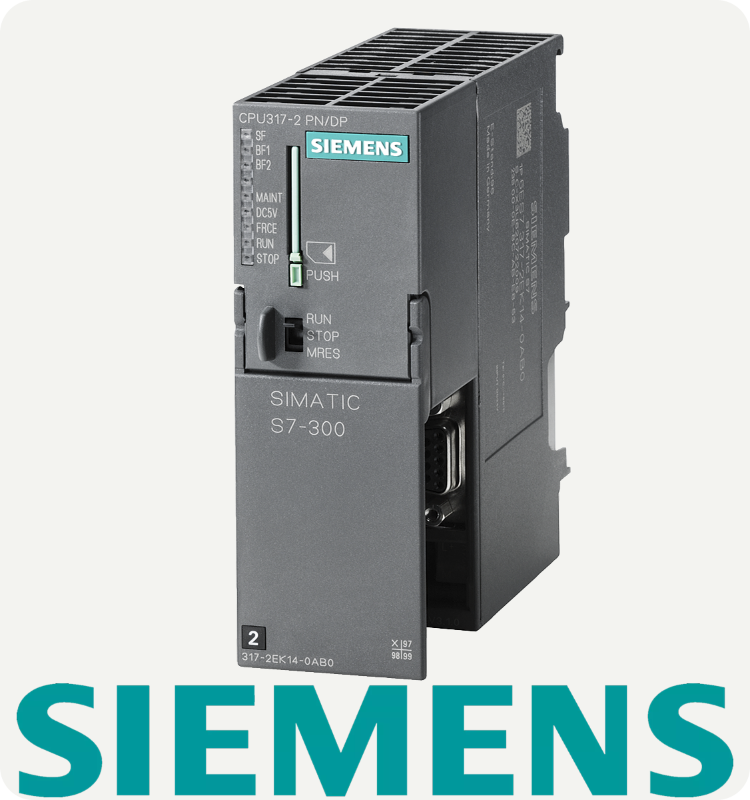

<h1 align="center">Hello 👋🏻, I'm Vinício Araújo</h1>
<h3 align="center">Mechanical Engineer with industrial experience, focusing on IIoT and Data Science. </h3>

  
I have experience with (automotive) industry, especially with maintenance and automation. 
Currently, my main activity is the application of IIoT and Data Science in the industry.
You can get more details on my <a href="https://www.linkedin.com/in/vinicio-araujo/" target="blank">LinkedIn.</a>

 
<h3 align="left">Relevant Informations</h3>
        
- 📔 I'm currently studying Data Science and Analytics at USP/Brazil (MBA/Master Business Administration).

- 🌱 I'm improving myself in Python and Machine Learning.

- 📂 Ask me about Node-Red, Power Bi and Industrial Automation in general.

- 📫 Contact: vinicio94@icloud.com or <a href="https://www.linkedin.com/in/vinicio-araujo/" target="blank">LinkedIn.</a>
 
<h3 align="left">Languages and Tools</h3>

                  
  

 
<h3 align="left">Repositories</h3>

<a href="xxx" target="_blank" rel="noreferrer">

1. <a href="https://github.com/VinicioAM/Python" target="_blank" rel="noreferrer">**Python** </a>
    * <a href="https://github.com/VinicioAM/Python/tree/main/K-Means" target="_blank" rel="noreferrer"> **K-Means:** </a> Application of K-Means Clustering (Machine Learning Method) in Industrial Dataset to group different types of manufactured pieces.
    * <a href="https://github.com/VinicioAM/Python/tree/main/KNN" target="_blank" rel="noreferrer">**KNN:**</a> Application and evaluating of K-Nearest Neighbors (Machine Learning Method) in Cancer Dataset to predict whether a person's tumor will be benign or malignant.  
    * <a href="https://github.com/VinicioAM/Python/tree/main/Bad%20Pieces%20Move" target="_blank" rel="noreferrer">**Bad Pieces Move:**</a> Script made to analyze a machine report and identify/discern bad pieces, saving time and improving the analysis of root cause.

2. <a href="https://github.com/VinicioAM/IIoT" target="_blank" rel="noreferrer">**IIoT**</a>
    * <a href="https://github.com/VinicioAM/IIoT/tree/main/Production_and_Scrap-Report" target="_blank" rel="noreferrer">**Production and Scrap Report:**</a>  Report made in Power BI to analyze production, scraps and failures in manufaturing, through automatic data acquisition from machine's PLCs.

3. <a href="https://github.com/VinicioAM/NodeJS_and_Node-Red" target="_blank" rel="noreferrer">**NodeJS_and_Node-Red**</a>
    * <a href="https://github.com/VinicioAM/NodeJS_and_Node-Red/tree/main/Parameter%20Check%20Automation" target="_blank" rel="noreferrer">**Parameter Check Automation:**</a> Automation of a manual process executed in industry by sending a report through WhatsApp/Telegram/E-mail, generating time gain and error reduction.
    * <a href="https://github.com/VinicioAM/NodeJS_and_Node-Red/tree/main/WhatsApp_Bot" target="_blank" rel="noreferrer">**WhatsApp Bot:**</a> Whatsapp bot that sends automatic messages. It has been integrated with another tool to read data from robots and machines.

  
<!--
### Hi there 👋

**VinicioAM/VinicioAM** is a ✨ _special_ ✨ repository because its `README.md` (this file) appears on your GitHub profile.

Here are some ideas to get you started:

- 🔭 I’m currently working on ...
- 🌱 I’m currently learning ...
- 👯 I’m looking to collaborate on ...
- 🤔 I’m looking for help with ...
- 💬 Ask me about ...
- 📫 How to reach me: ...
- 😄 Pronouns: ...
- ⚡ Fun fact: ...
<!--
-->
